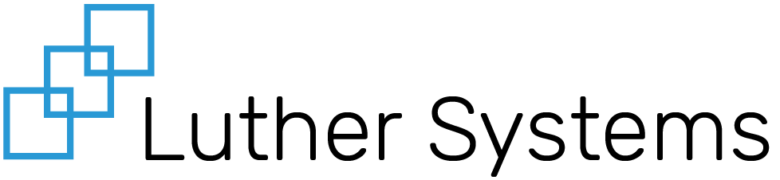

# Introduction

## Welcome

These docs are designed to assist developers using the Luther Systems platform to build and deploy applications.&#x20;

The documentation is broken down into 3 main sections:

### Application

Go here to learn how to build your application

### Platform

Go here to understand the Luther platform and how to interact with it

### Infrastructure

Go here for information on how to deploy and host your application

## Platform Updates

Go [here](/announcements.md) for major platform announcements.

Go [here](./release-notes.md) for the release notes of the platform.

## Questions?

Go [here](./faq.md) for frequently asked questions.

Go [here](./contact-us.md) for different ways to reach us.
